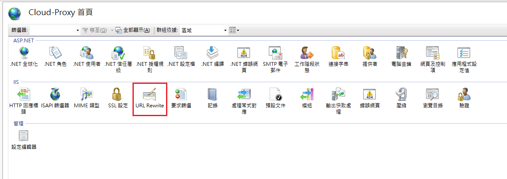
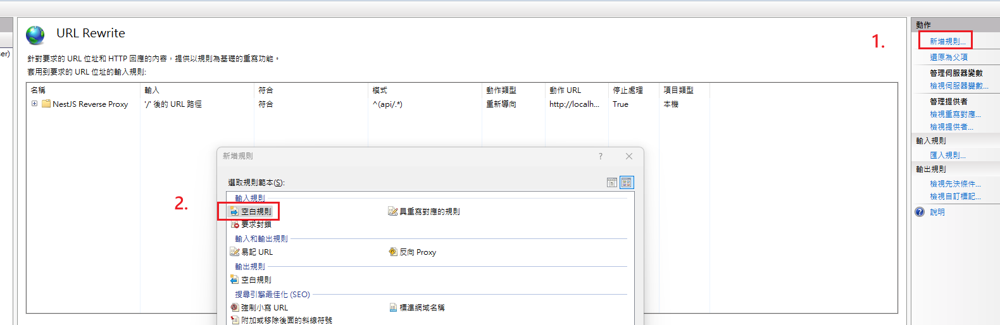
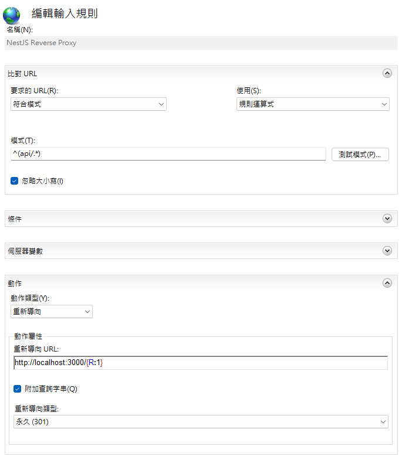

<p align="center">
  <a href="http://nestjs.com/" target="blank"></a>
</p>

[circleci-image]: https://img.shields.io/circleci/build/github/nestjs/nest/master?token=abc123def456
[circleci-url]: https://circleci.com/gh/nestjs/nest

  <p align="center">A progressive <a href="http://nodejs.org" target="_blank">Node.js</a> framework for building efficient and scalable server-side applications.</p>
    <p align="center">
<a href="https://www.npmjs.com/~nestjscore" target="_blank"></a>
<a href="https://www.npmjs.com/~nestjscore" target="_blank"></a>
<a href="https://www.npmjs.com/~nestjscore" target="_blank"></a>
<a href="https://circleci.com/gh/nestjs/nest" target="_blank"></a>
<a href="https://discord.gg/G7Qnnhy" target="_blank"></a>
<a href="https://opencollective.com/nest#backer" target="_blank"></a>
<a href="https://opencollective.com/nest#sponsor" target="_blank"></a>
  <a href="https://paypal.me/kamilmysliwiec" target="_blank"></a>
    <a href="https://opencollective.com/nest#sponsor"  target="_blank"></a>
  <a href="https://twitter.com/nestframework" target="_blank"></a>
</p>
  <!--[](https://opencollective.com/nest#backer)
  [](https://opencollective.com/nest#sponsor)-->

## Description

[Nest](https://github.com/nestjs/nest) framework TypeScript starter repository.

## Project setup

```bash
$ npm install
```

## Compile and run the project

```bash
# development
$ npm run start

# watch mode
$ npm run start:dev

# production mode
$ npm run start:prod
```

## Run tests

```bash
# unit tests
$ npm run test

# e2e tests
$ npm run test:e2e

# test coverage
$ npm run test:cov
```

## Deployment

When you're ready to deploy your NestJS application to production, there are some key steps you can take to ensure it runs as efficiently as possible. Check out the [deployment documentation](https://docs.nestjs.com/deployment) for more information.

If you are looking for a cloud-based platform to deploy your NestJS application, check out [Mau](https://mau.nestjs.com), our official platform for deploying NestJS applications on AWS. Mau makes deployment straightforward and fast, requiring just a few simple steps:

```bash
$ npm install -g @nestjs/mau
$ mau deploy
```

With Mau, you can deploy your application in just a few clicks, allowing you to focus on building features rather than managing infrastructure.

## Resources

Check out a few resources that may come in handy when working with NestJS:

- Visit the [NestJS Documentation](https://docs.nestjs.com) to learn more about the framework.
- For questions and support, please visit our [Discord channel](https://discord.gg/G7Qnnhy).
- To dive deeper and get more hands-on experience, check out our official video [courses](https://courses.nestjs.com/).
- Deploy your application to AWS with the help of [NestJS Mau](https://mau.nestjs.com) in just a few clicks.
- Visualize your application graph and interact with the NestJS application in real-time using [NestJS Devtools](https://devtools.nestjs.com).
- Need help with your project (part-time to full-time)? Check out our official [enterprise support](https://enterprise.nestjs.com).
- To stay in the loop and get updates, follow us on [X](https://x.com/nestframework) and [LinkedIn](https://linkedin.com/company/nestjs).
- Looking for a job, or have a job to offer? Check out our official [Jobs board](https://jobs.nestjs.com).

## Support

Nest is an MIT-licensed open source project. It can grow thanks to the sponsors and support by the amazing backers. If you'd like to join them, please [read more here](https://docs.nestjs.com/support).

## Stay in touch

- Author - [Kamil Myśliwiec](https://twitter.com/kammysliwiec)
- Website - [https://nestjs.com](https://nestjs.com/)
- Twitter - [@nestframework](https://twitter.com/nestframework)

## License

Nest is [MIT licensed](https://github.com/nestjs/nest/blob/master/LICENSE).


##  版本控制
儲能
  v2.0  完成儲能初步架構，swagger 可以順利開啟
  v2.1  完成儲能Request body欄位，可在Request body中輸入資料，並檢視對應資料表資料是否更新
  v2.2  調整儲能Request body欄位，已有預設資料，測試時需要調整內文資料數值
  v2.3  完成太陽能Request body欄位，所有[ReceivedTime] 統一更改為[Received_Time]
  v2.4  卡片後面補上簡短說明與格式撰寫
  v2.5  各項命名方式及網址更改


# Solar Equipment Generation API

這是一個基於 NestJS 開發的太陽能設備發電資料管理 API 系統，提供 RESTful API 介面來接收和管理多個案場的太陽能設備發電資料。

## 主要功能

- ✅ 接收單筆太陽能設備發電資料
- ✅ 批次接收多筆發電資料
- ✅ 查詢發電資料（支援分頁和篩選）
- ✅ 取得發電統計資料
- ✅ 根據設備 ID 查詢最新資料
- ✅ API Key 認證機制
- ✅ 資料驗證和錯誤處理
- ✅ Swagger API 文件

## 技術棧

- **框架**: NestJS
- **資料庫**: Microsoft SQL Server
- **ORM**: TypeORM
- **驗證**: Class-validator
- **文件**: Swagger/OpenAPI
- **語言**: TypeScript

## 安裝與設定

### 1. 安裝依賴套件

```bash
npm install
```

### 2. 環境變數設定

複製 `.env` 檔案並設定相關參數：

```bash
# 應用程式設定
NODE_ENV=development
PORT=3000

# 資料庫設定
DB_HOST=localhost
DB_PORT=1433
DB_USERNAME=your_username
DB_PASSWORD=your_password
DB_DATABASE=your_database_name
DB_ENCRYPT=true
DB_TRUST_CERT=true

# API 金鑰設定
API_KEY=your-super-secret-api-key-here

# CORS 設定
ALLOWED_ORIGINS=http://localhost:3000,http://localhost:3001
```

### 3. 資料庫設定

確保您的 SQL Server 資料庫中已建立 `Solar_equipment_generation_his` 表格：

```sql
CREATE TABLE [dbo].[Solar_equipment_generation_his](
    [History_ID] [int] IDENTITY(1,1) NOT NULL,
    [Generation_ID] [int] NOT NULL,
    [Solar_site_ID] [int] NOT NULL,
    [Location_ID] [int] NOT NULL,
    [Equipment_ID] [int] NOT NULL,
    [Data_time] [datetime] NOT NULL,
    [ReceivedTime] [datetime] NOT NULL,
    [Serial_number] [nvarchar](max) NULL,
    [Generation_P_daily] [decimal](8, 2) NULL,
    [Generation_P_all] [decimal](12, 0) NULL,
    [Sunshine_meter] [decimal](7, 3) NULL,
    [Sunshine_meter_avg] [decimal](5, 3) NULL,
    [Error_code] [nvarchar](max) NULL,
    PRIMARY KEY CLUSTERED ([History_ID] ASC)
);
```

## 啟動應用程式

### 開發模式

```bash
npm run start:dev
```

### 生產模式

```bash
npm run build
npm run start:prod
```

應用程式將在 `http://localhost:3000` 啟動

## API 文件

啟動應用程式後，可透過以下網址查看 Swagger API 文件：

```
http://localhost:3000/api-docs
```

## API 端點

所有 API 都需要在 Header 中包含 `X-API-Key` 進行認證。

### 基礎路徑

```
http://localhost:3000/api/v1/solar-equipment
```

### 主要端點

#### 1. 建立單筆資料

```http
POST /api/v1/solar-equipment
Content-Type: application/json
X-API-Key: your-api-key

{
  "generationId": 1001,
  "solarSiteId": 2001,
  "locationId": 3001,
  "equipmentId": 4001,
  "dataTime": "2024-01-15T10:30:00.000Z",
  "serialNumber": "SN123456789",
  "generationPDaily": 25.75,
  "generationPAll": 15000,
  "sunshineMeter": 8.523,
  "sunshineMeterAvg": 7.852,
  "errorCode": null
}
```

#### 2. 批次建立資料

```http
POST /api/v1/solar-equipment/batch
Content-Type: application/json
X-API-Key: your-api-key

{
  "data": [
    {
      "generationId": 1001,
      "solarSiteId": 2001,
      "locationId": 3001,
      "equipmentId": 4001,
      "dataTime": "2024-01-15T10:30:00.000Z",
      "serialNumber": "SN123456789",
      "generationPDaily": 25.75,
      "generationPAll": 15000,
      "sunshineMeter": 8.523,
      "sunshineMeterAvg": 7.852
    }
  ]
}
```

#### 3. 查詢資料

```http
GET /api/v1/solar-equipment?page=1&limit=10&solarSiteId=2001
X-API-Key: your-api-key
```

查詢參數：
- `page`: 頁數（預設：1）
- `limit`: 每頁筆數（預設：10，最大：100）
- `generationId`: 發電機 ID
- `solarSiteId`: 太陽能案場 ID
- `locationId`: 位置 ID
- `equipmentId`: 設備 ID
- `startDate`: 開始日期
- `endDate`: 結束日期
- `serialNumber`: 設備序號

#### 4. 取得統計資料

```http
GET /api/v1/solar-equipment/statistics?solarSiteId=2001
X-API-Key: your-api-key
```

#### 5. 取得設備最新資料

```http
GET /api/v1/solar-equipment/equipment/4001/latest
X-API-Key: your-api-key
```

#### 6. 取得單筆資料

```http
GET /api/v1/solar-equipment/1
X-API-Key: your-api-key
```

## 錯誤處理

API 遵循標準的 HTTP 狀態碼：

- `200`: 成功
- `201`: 建立成功
- `400`: 請求錯誤（資料驗證失敗）
- `401`: 認證失敗（API Key 錯誤）
- `404`: 資源不存在
- `500`: 伺服器內部錯誤

錯誤回應格式：

```json
{
  "statusCode": 400,
  "message": "驗證失敗",
  "error": "Bad Request"
}
```

## 資料驗證

API 會自動驗證輸入資料，確保：

- 必填欄位不可為空
- 數值欄位格式正確
- 日期格式符合 ISO 8601 標準
- 數值範圍在合理區間內

## 安全性

- 所有 API 都需要 API Key 認證
- 使用 Helmet 中間件增強安全性
- 支援 CORS 跨域請求控制
- 資料驗證防止注入攻擊

## 日誌記錄

系統會記錄：
- API 請求和回應
- 資料庫操作
- 錯誤訊息和堆疊追蹤
- 重要業務操作

## 測試

```bash
# 單元測試
npm run test

# 端對端測試
npm run test:e2e

# 測試涵蓋率
npm run test:cov
```

## 部署

### windows 環境 npm 套件

📦 安裝套件（全域）
``` powershell
npm install -g pm2
npm install -g pm2-windows-startup
```
⚙️ 註冊開機啟動（需要權限）
``` powershell
pm2-startup install
```

### windows IIS 反向代理設定





### Docker 部署（可選）

可以建立 Dockerfile 來容器化應用程式：

```dockerfile
FROM node:18-alpine
WORKDIR /app
COPY package*.json ./
RUN npm ci --only=production
COPY dist ./dist
EXPOSE 3000
CMD ["node", "dist/main"]
```

### 環境變數檢查清單

部署前確認以下環境變數已正確設定：

- [ ] `DB_HOST` - 資料庫主機位址
- [ ] `DB_USERNAME` - 資料庫使用者名稱
- [ ] `DB_PASSWORD` - 資料庫密碼
- [ ] `DB_DATABASE` - 資料庫名稱
- [ ] `API_KEY` - API 認證金鑰
- [ ] `NODE_ENV` - 環境模式（production）

## 授權

此專案僅供內部使用。

## 支援

如有問題或需要協助，請聯繫開發團隊。